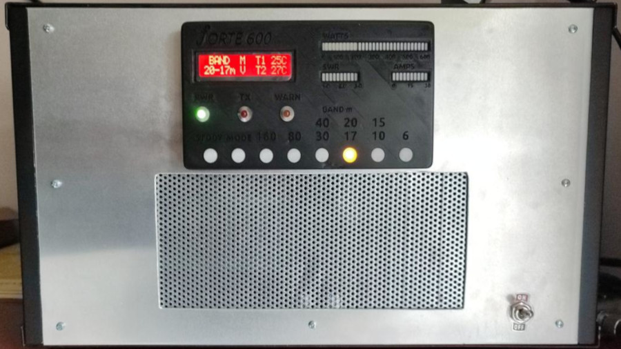

# RF_Power_Amplifier_Controller_V1
Software for solid state (LDMOS/BJT) high power ham radio amplifier. This is first version of the software for the Forte 600 W amplifier based on MRF300 transistors and targets STM32F103 mcu.

For more detailed description of the amplifier check out my website (SP6GK.com: https://www.sp6gk.com/Forte_600W_Amplifier.html)
The controller developed for the Forte 600 can be utilized with other amplifiers or retrofitted into older amplifier models.

# Linear Amplifier Project

This project focuses on the development of a linear amplifier designed to operate within amateur radio bands, spanning from 1.8 to 30 MHz, with additional support for the 50 MHz band. The software is specifically targeted for the STM32F103 microcontroller on the Blue Pill development board.

## Libraries Used

- **STM32-LCD-HD44780-I2C** by firebull (GitHub: https://github.com/firebull/STM32-LCD-HD44780-I2C)
- **DS18B20 STM32 HAL Library** by Mateusz Salamon and Michal Dunajski (GitHub: https://github.com/lamik/DS18B20_STM32_HAL/tree/master)
- **STM32 74HC595 Driver** by GlideLeo (GitHub: https://github.com/GlideLeo/STM32_74HC595_Driver/tree/master)
- **MAX7219 Driver** by EmbeddedExpertIO (https://blog.embeddedexpert.io/?p=2513)

## Features

- **Real-Time Operating System (FreeRTOS)** for responsive interface and rapid protection against overcurrent, overvoltage, overpower, high reflection, etc.
- Support for multiple DS18B20 thermometers (minimum of 2 expected).
- PWM control of fans with programmable speed curves.
- Support for three directional couplers (input, deck output, LPF output).
- Handling of nonlinearity of directional coupler by polynomial function.
- Drain current readout from ratiometric sensor (ACS712).
- Drain voltage readout.
- Calibration of voltage/current readings handled in software.
- Transmit/Relay switching and sequencing.
- Bias and drain voltage switching.
- Fault handler implementing fail-safe mechanisms and resolution code for different error codes.

## Hardware Specifications

- 32-bit MCU STM32F103 with Cortex M3 core operating at 64 MHz.
- 12-bit ADC with DMA for fast measurements with no processor overhead, oversampling applied for better precision.

## Human-Machine Interface (HMI)

- Three bar graphs (60 segments for forward power, 10 segments for drain current, 10 segments for SWR).
- 16x2 Alphanumeric LCD display.
- Three LEDs.

## Band Selection

- Analog (programmable ranges, default setting is compatible with Xiegu G90).
- 3-bit binary (truth table for 6 LPFs).
- Manual (reads 3-bit bus from the front panel, implemented with another microcontroller with EEPROM that remembers the last selected band and implements radio buttons).

## User Buttons

- **Standby:** Amplifier acts as a pass-through.
- **Mode:** Changes band selection mode.

## Notes

This software has been utilized in my amplifier and has been proven to work effectively. Ensure your ADC inputs are not floating and are well decoupled from RF to avoid triggering the fault handler. I am currently working on second version which will include color LCD. Controller for this version had some issues which I have resolved by bodge wires on the PCB but I haven't documented those...
Schematics for the rev. 1.0 of the controller have been corrected but I am not planning on making a new PCB revision, instead I will work on version 2.
